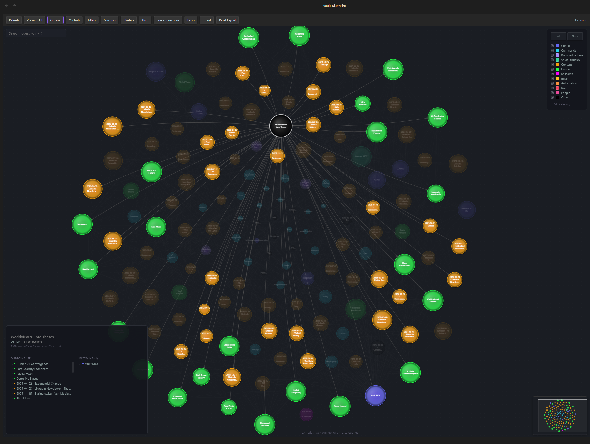

# Ngram

**Advanced vault graph visualization for Obsidian.** A supercharged replacement for the built-in [Graph View](https://help.obsidian.md/Plugins/Graph+view) core plugin.



## What is this?

Obsidian's built-in Graph View shows your vault as a basic node graph. Ngram takes that concept and pushes it much further — adding real graph analysis, interactive controls, and visual intelligence that makes your vault's structure actually useful.

## Features

### Two View Modes
- **Schematic** — rectangular nodes with labeled pins, wires, and collapsible folder groups
- **Organic** — force-directed circular nodes with physics simulation and real-time controls

### Graph Analysis
- **Cluster Detection** — label propagation algorithm identifies communities in your vault (3+ member threshold to reduce noise)
- **Gap Analysis** — finds notes that share tags but have no direct link, surfacing missing connections
- **Node Importance Sizing** — scale nodes by connections, betweenness centrality, or PageRank
- **Bridge Node Detection** — highlights notes that connect different communities

### Interactive Features
- **Lasso Selection** — draw freeform selections to collapse groups of nodes
- **Wire Drag** — drag from node to node to create new `[[wikilinks]]` in your vault
- **Context Menu** — right-click for: open, split view, reveal in explorer, copy wiki link, set category, delete
- **Category Color Picker** — click any legend color dot to customize category colors
- **Custom Categories** — add your own categories with "+ Add Category" in the legend
- **Vault Write-Back** — setting a category writes `type:` frontmatter directly to the note file

### Visualization
- **Category-based coloring** — automatic categorization by folder structure, tags, and frontmatter
- **Default categories** — Config, Knowledge Base, Content, Concepts, Business, MOC, Templates, Research, Ideas
- **Minimap** — navigable overview in the corner
- **Search** — find and highlight nodes by name
- **Filters** — filter by wire type (links, semantic, embeds, tags)
- **PNG Export** — export the current view as a high-res image
- **Node Preview** — hover to see note content preview
- **Info Panel** — click a node to see connections, tags, backlinks

### Controls (Organic Mode)
- Center force, repel force, link force, link distance
- Node size, link thickness, arrow toggles
- Text fade threshold
- Re-animate simulation button

## Installation

### Manual Installation
1. Download `main.js`, `manifest.json`, and `styles.css` from the [latest release](https://github.com/Aragorn2046/obsidian-ngram/releases)
2. Create a folder `ngram` inside your vault's `.obsidian/plugins/` directory
3. Copy the three files into that folder
4. Enable "Ngram" in Obsidian Settings > Community Plugins

### From Source
```bash
git clone https://github.com/Aragorn2046/obsidian-ngram.git
cd obsidian-ngram
npm install
npm run build
```
Then copy `main.js`, `manifest.json`, and `styles.css` to your vault's `.obsidian/plugins/ngram/` folder.

## Usage

1. Click the network icon in the ribbon, or run the command "Open Ngram"
2. Toggle between Schematic and Organic views with the toolbar button
3. Use the toolbar for: Clusters, Gaps, Node Size, Lasso, Export, and more
4. Right-click any node for the full context menu
5. Drag between nodes to create wiki links

## Settings

- **View mode** — Schematic or Organic (default)
- **Excluded paths** — folders to skip during scanning
- **Minimum backlinks** — threshold for including notes (0 = show all)
- **Show folder groups** — render folder structure as group boxes (schematic mode)
- **Category overrides** — map folder patterns to custom category names

## Built With

- TypeScript + esbuild
- HTML5 Canvas (zero-dependency rendering)
- Obsidian Plugin API

## License

MIT
